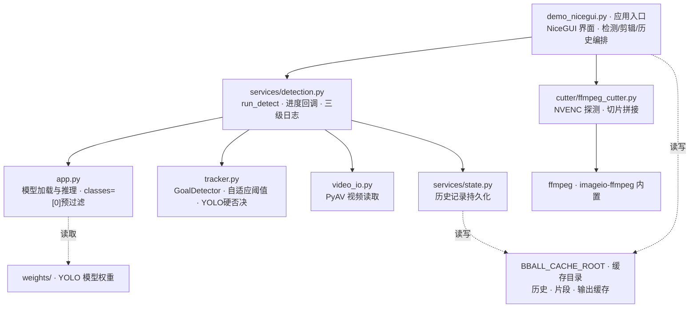

# basketball-clipper

篮球录像进球检测与自动剪辑工具，专为**固定机位**比赛录像设计。手动标定篮筐后，自动检测进球时刻并剪辑集锦。

## 核心特性

- **固定机位免微调**：手动框选篮筐即可，无需重新训练模型
- **diff + YOLO 双通道硬否决**：基准帧差法高召回扫描候选进球，YOLO 对三条进球路径（宽松模式、视觉穿越、侧向进筐）做硬否决（篮筐附近±1倍宽高无球直接排除），从源头消除误检
- **自适应帧差阈值**：检测前 30 秒预热，统计 P95 像素差分中位数，自动计算最优二值化阈值（+8 偏移，clamp 到 [8, 50]），无需手动调参适配不同环境噪声
- **滚动基准帧**：每 60 秒自动更新基准帧，解决长视频光线/背景变化导致的漏检
- **独立片段预览 + 人工确认**：每个检测到的进球生成独立 480p 预览片段，卡片列表支持预览 / 导出 / 删除
- **原画质集锦输出 + GPU 加速**：集锦视频保持原视频分辨率，自动探测 NVIDIA NVENC 硬编码（cq=20），无 NVENC 回退 libx264（crf=18）接近无损；剪辑环节走 ffmpeg 直接切片转码
- **GPU 硬性要求 + 启动自检**：YOLO 推理必须使用 CUDA（不支持 CPU 降级）；服务启动时主线程执行真实 YOLO 推理自检，失败则页面顶部红色横幅提示并支持一键确认重启，避免跑完才发现 CUDA 异常
- **提速模式开关（YOLO 每 3 帧推理）**：参数面板最顶部一键切换，默认每 2 帧（推荐，更准），勾选后每 3 帧推理（提速 ~27%，1st.mp4 实测进球数一致，漏检风险极低）
- **条件跳过 YOLO（篮筐无运动时跳过推理）**：参数面板顶部开关，YOLO 推理帧先快速检查篮筐搜索区域是否有运动像素（1ms），无运动则跳过 YOLO 推理（省 ~60ms），实测跳过率 30-41%，总提速 40%（25 min → 15 min）
- **视频兼容性强**：PyAV 读取，支持 HEVC 编码和 moov atom 后置的 mp4
- **跨平台**：Windows / Linux 均支持，缓存路径可通过环境变量 `BBALL_CACHE_ROOT` 自定义
- **历史记录**：保存检测数据，支持加载后直接剪辑（无需重新检测）；片段缓存持久化，重启后复用已生成的预览片段
- **文件夹批量模式**：加载文件夹自动扫描视频，逐个标定后一键批量识别，适合多场比赛录像
- **L4 进球验证器（四臂集成）**：检测完成后后台自动为片段打分（LGBM / 时序 / 光流 / VideoMAE 集成），两端自动 √/×；默认模式含每场自适应校准，全自动模式零人工出粗剪（盲测精确率 100% / 召回 79%）
- **批量断点续跑**：检测进度实时写检查点，中断/崩溃后用相同参数从断点继续，已完成视频自动跳过
- **NiceGUI 可视化界面**：深色主题卡片式布局，左侧功能区 + 右侧预览区，参数 / 集锦 / 历史折叠区；检测中可随时取消，进球列表出现后自动折叠功能区
- **三级调试日志**：开始横幅（视频信息/帧率/YOLO step/阈值配置）+ 周期进度（30s 一次，瞬时/平均帧速/ETA/进球累计）+ 结束统计（YOLO 确认率/上下穿越/筐内/冷却拒绝/自动阈值统计量），日志按日写入 `cache/logs/server-YYYYMMDD.log`（保留 7 天）可溯源

## 性能实测

- **GTX 1650 4G，1080p**：整场 4 节批量 1h51m 约 51 分钟跑完（平均 ~2× 实时）；2026.08.18 优化后批量 2.6~2.8×、单节最高 3.8× 实时
- 检测帧速 65~115 fps，条件跳过 YOLO 跳过率最高 ~70%；提速模式（YOLO 每 3 帧）实测零漏检
- 完整实测记录与新旧版本对比见 [doc/performance.md](doc/performance.md)

## 环境要求

- Windows / Linux
- Python 3.10+
- NVIDIA GPU（**必需**，推荐 GTX 1650 4G 及以上；CUDA 不可用时服务拒绝检测，不做 CPU 降级）
- FFmpeg（含 libx264 + h264_nvenc，由 `imageio-ffmpeg` 自带）

## 快速开始

### 1. 安装依赖

```bash
pip install -r requirements.txt
```

> 需安装 CUDA 版 PyTorch（GPU 为硬性要求）：`pip install torch torchvision --index-url https://download.pytorch.org/whl/cu121`

### 2. 准备权重

将篮球检测 YOLO 权重放到 `weights/` 目录，命名为 `basketball_custom.pt`。若没有，首次运行会自动下载 `yolov8n.pt`（COCO 预训练，检测效果有限，建议自行训练）。

### 3. 启动服务

```bash
python demo_nicegui.py
# 浏览器打开 http://127.0.0.1:7871
```

Windows 下可双击 `start.bat`，Linux 下运行 `./start.sh` 一键启动（会自动清理占用端口 7871 的旧进程，并打印 `WARMUP-OK: cuda:0 context created on main thread` 确认 CUDA 预热完成）。

### 单视频操作流程

1. 左侧输入视频文件路径（支持超大文件，不走浏览器上传），点击「加载」
2. 在预览画面点击 2 个点框选篮筐（同时采集无球基准帧），可「重置」重新标定
3. 在「参数」折叠区最顶部可开启 **提速模式**（YOLO 每 3 帧推理一次，提速约 27%）；下方设置起始帧、结束帧、球检测置信度、最小进球间隔；高级项可开关自适应阈值（默认开，30s 预热后自动计算帧差阈值）或手动调帧差阈值、圆形度、进框帧数、最小斑块、搜索范围
4. 点击「开始识别」→ 检测过程中右侧显示进度，控制台/`cache/logs/server-YYYYMMDD.log` 每 30 秒打印一次瞬时帧速、ETA、累计进球数；完成后生成每个进球的独立预览片段
5. 进球列表卡片上点击「预览」查看片段、「导出」下载单个片段、「删除」剔除误报
6. 在「集锦」折叠区设置提前 / 延后 / 合并间隔，点击「导出合集」→ 生成原画质集锦并自动下载
7. 历史记录保存在「历史」折叠区，点击选择后「加载」即可直接剪辑（无需重新检测）；命中缓存时复用已有片段，无需重新生成

### 文件夹批量模式操作流程

1. 左侧输入文件夹路径（如 `D:\Videos\games`），点击「加载」→ 自动扫描所有视频文件
2. 下拉框选择视频，点击画面 2 个点标定篮筐，点击「保存标定」→ 逐个完成所有视频标定
3. 在「参数」折叠区设置检测参数（同单视频模式，含提速模式开关）
4. 点击「批量识别」→ 依次处理所有视频，每个视频独立写入历史记录
5. **流水线确认（无需干等）**：每个视频完成时下拉框标记为 `☑ 文件名 (n球)`，点击即可立即查看该视频的进球列表、删除误报、预览片段、导出集锦——后台继续识别其余视频，互不干扰
6. 左侧「后台识别进度条」常驻显示批量总进度（点击可切回完整进度视图）；流水线导出集锦时有独立进度条，与批量进度并列
7. 处理过程中可点击「取消」中断，已完成视频的结果与人工删减保留
8. 批量结束后再点已完成视频：优先从快照水合（保留你的删减结果，秒加载）；总进球数写入 `[BATCH END]` 日志

## 项目结构

```
basketball-clipper/
├── demo_nicegui.py         # 主程序：NiceGUI 界面 + 检测/剪辑/历史流程编排
├── app.py                  # 核心库：YOLO 球检测模型加载与推理
├── tracker.py              # GoalDetector：diff 帧差 + YOLO 硬否决 + 滚动基准帧 + 自适应阈值
├── video_io.py             # PyAV 视频读取（HEVC/moov 兼容）
├── services/
│   ├── detection.py        # run_detect / run_batch_detect：逐帧检测循环 + 三级调试日志 + 进度回调 + 断点续跑
│   ├── goal_verifier.py    # L4 进球验证器：四臂集成打分 + 自动√/× + 场次校准/全自动模式
│   ├── hoop_tracker.py     # 检测中篮筐移位自动跟踪
│   ├── state.py            # detection_history.json / 片段缓存读写（含分数与标记持久化）
│   └── video_utils.py      # 视频元信息获取（fps/分辨率/时长）
├── cutter/ffmpeg_cutter.py # ffmpeg 剪辑（自动探测 NVENC；切片转码 + 流拷贝拼接，保持原画质）
├── training/               # 训练/评测脚本与轻量产物（模型权重不入库，走 Release）
├── tests/                  # 单元测试（90 用例）
├── doc/                    # 更新日志与性能实测记录
├── weights/                # YOLO 权重（不入库，用 Release 发布）
├── start.bat               # Windows 一键启动（自动清理 7871 端口，日志按日轮转）
├── start.sh                # Linux 一键启动（日志按日轮转）
├── cache/logs/             # 运行时日志 server-YYYYMMDD.log（保留 7 天，三级调试信息）
└── requirements.txt        # 依赖
```

## 项目架构

核心模块分层与依赖（实线为模块调用，虚线为数据/文件读写）：



- **demo_nicegui.py**：唯一入口，负责界面渲染与检测 / 剪辑 / 历史全流程编排，后台线程执行耗时任务
- **services/detection.py**：检测调度层，封装 `run_detect` / `run_batch_detect`，负责进度回调（`progress_callback`）、三级日志输出、批量流程、异常捕获
- **app.py**：YOLO 球检测模型懒加载与推理，`model.predict(imgsz=960, classes=[0])` 后处理预过滤篮球类，减少 NMS 开销
- **tracker.py**：`GoalDetector` 进球判定，自适应阈值（30s 预热统计 P95 中位数 → `auto_thr = median_p95 + 8`）、形态学 kernel 缓存、`cv2.countNonZero`、三条进球路径 YOLO 硬否决
- **video_io.py**：PyAV 统一视频读取，被 detection 与 demo_nicegui 共同依赖
- **services/state.py**：`detection_history.json` 读写（视频路径 / 标定 / 进球 / 保留进球 / 时间戳），片段缓存与分数/标记持久化
- **services/goal_verifier.py**：L4 进球验证器——检测完成后后台线程对片段做四臂集成打分（LGBM / B 时序 / Flow 光流 / VideoMAE），两端自动 √/×，默认模式每场自适应校准，全自动模式零人工粗剪
- **services/hoop_tracker.py**：检测中篮筐移位（支架被撞等）自动跟踪，配合 `tracker.set_hoop` 复位判定状态机
- **cutter/ffmpeg_cutter.py**：按进球时间戳切片拼接，自动探测 `h264_nvenc`，命中则 NVENC 硬编，未命中回退 libx264
- **外部资源**：`weights/`（模型权重）、缓存目录（历史记录 / 片段 / 输出，默认 `~/basketball-project/cache`，可通过 `BBALL_CACHE_ROOT` 环境变量自定义）、ffmpeg（imageio-ffmpeg 内置）

## 进球检测算法详解

### 整体架构：diff + YOLO 双通道硬否决

```
原视频 → PyAV 逐帧解码
          ↓
    ┌─────┴─────┐
    ↓           ↓
  diff 帧差    YOLO 检测（每2或3帧一次, imgsz=960, classes=[0]）
 (高召回)        (球位置, 存入 ball_pos_history 时间窗口)
    ↓           ↓
    └─────┬─────┘
          ↓
   diff 触发候选进球（三条路径任一满足）
     ├── 宽松模式：斑块在筐内帧数 ≥ min_in_hoop_frames（默认 2）
     ├── 视觉穿越：斑块先经过筐上沿 → 再进入筐下沿（向下趋势）
     └── 侧向进筐：直接从侧面进入筐内，不经过上沿
          ↓
   每条路径 → 必须通过 YOLO 硬否决
         （篮筐附近 ±1 倍宽高范围内，±10帧时间窗内是否有球）
     ├── 通过 → 注册进球，计数 yolo_confirmed
     └── 未通过 → 直接排除（不注册），计数 yolo_rejected
          ↓
   注册候选进球 → 生成独立预览片段（ffmpeg 切片转码 480p）
          ↓
   人工逐个确认保留/删除（卡片预览 + 删除按钮）
          ↓
   生成集锦（NVENC cq=20 / libx264 crf=18 原画质）
```

### 第一阶段：diff 基准帧差法（候选筛选）

标定时取一帧无球画面作为**基准帧**，之后每帧与基准帧做差分检测运动物体。

**步骤**：

1. **基准帧采集**：用户点击 2 个点标定篮筐时，当前帧自动保存为基准帧（无球的篮筐画面）
2. **自适应阈值预热**：若开启自适应阈值（默认），检测前 30 秒逐帧统计篮筐区域像素差分的 P95（0-255），结束后取中位数 + 8 作为二值化阈值，clamp 到 [8,50]；统计量写入结束日志（`median_p95` / `samples`）便于调参
3. **灰度差分**：当前帧与基准帧转为灰度图，做 `cv2.absdiff` 绝对差分
4. **二值化**：差分图按阈值（默认自动，可手动覆盖 5-40）二值化
5. **形态学去噪**：开运算（5×5 椭圆核，缓存为 `_morph_kernel`，只初始化一次）去孤立噪点 + 闭运算连接相邻区域
6. **连通域分析**：`cv2.findContours` 找所有连通域，可获取周长计算圆形度
7. **差分比统计**：`cv2.countNonZero(diff_bin) / diff_bin.size`（替代 `np.sum`，减少 Python 级循环开销）
8. **斑块筛选**：
   - 面积在 `[min_blob_area, max_blob_area]` 范围内（默认 30-5000）
   - 宽度不超过篮筐宽度的 1.5 倍（排除球员身体）
   - 圆形度 C=4πA/P² ≥ `min_circularity`（过滤长条形人体，球≈0.7-1.0，人≈0.2-0.5）
   - 取面积最大的有效连通域作为候选运动斑块

**为什么用基准帧差法？**
- 固定机位下基准帧稳定，差分信号强
- 检测的是"运动物体"本身，不依赖 YOLO 是否检测到球（高召回）
- 规则明确：斑块进框 = 候选，保证不丢真实进球

### 第二阶段：三条进球路径 + YOLO 硬否决（误检过滤）

diff 触发候选后，分三条路径注册进球，每条路径均需通过 **YOLO 硬否决**，否则直接排除、不注册。

#### 三条进球路径

| 路径 | 触发条件 | 适用场景 |
|------|---------|---------|
| 宽松模式 (loose) | 斑块中心连续 `min_in_hoop_frames`（默认 2）帧位于篮筐框内 | 球直上直下，穿越路线清晰 |
| 视觉穿越 (visual) | 斑块先出现在筐上沿区域 → 再进入筐内（向下趋势检查） | 正面 45° 视角的常规进球 |
| 侧向进筐 (side) | 斑块直接进入筐内但不经过上沿（侧视角） | 底角、底线侧视角进球 |

#### YOLO 硬否决逻辑（三条路径全覆盖）

1. **球位置历史缓存**：YOLO 每推理一次就把（时间戳、球中心 x、球中心 y）推入 `ball_pos_history`，缓存最近 ±10 帧时间窗
2. **篮筐附近区域定义**：篮筐标定框外扩 1 倍宽度 / 1 倍高度（`margin_x=hoop_w*1.0`, `margin_y=hoop_h*1.0`），覆盖球即将入筐前的减速区
3. **硬否决判断**：当 diff 要注册进球时，遍历 YOLO 历史检查是否有球落在"篮筐附近"区域内
   - 有球 → `yolo_confirmed + 1` → **通过，注册进球**
   - 无球 → `yolo_rejected + 1` → **否决，直接排除，不注册**
4. **为什么是硬否决而不是软确认？**
   - 实测背景噪声大的视频（1st.mp4）会产生成百上千假穿越，软确认+人工确认负担过重
   - 球穿越篮筐窗口 0.03-0.08 秒内必然出现在 YOLO 帧中（即使每 3 帧推理），窗口设计留有余量
   - 批量视频对比（1st 从 183 误检 → 32；3rd 从 65 → 45）证明硬否决同时过滤误检且保留真实进球

#### 冷却机制（防重复计数）

- 刚注册进球后进入 3 秒冷却期，冷却期内触发的任何路径都计入 `reject_cooldown`，不重复注册
- 可通过「最小进球间隔」滑块扩展冷却期（1.0-10.0 秒，默认 3.0s）

### YOLO 篮球检测

- **模型**：自定义训练的 `basketball_custom.pt`（基于 YOLOv8n），由 `app.py` 懒加载并搬移到 GPU（GPU 为硬性要求，无 CUDA 时拒绝推理）
- **推理分辨率**：`imgsz=960`（默认，平衡小目标检出与推理速度；基准 1280 降 ~20% 速度）
- **类别预过滤**：`classes=[0]`，仅保留篮球类后再做 NMS，减少后处理开销（非篮球类即使被检测到也直接丢弃）
- **置信度阈值**：默认 0.3（可调 0.1-0.9）
- **跳帧推理**：默认每 2 帧推理一次（覆盖 50%），可开提速模式每 3 帧推理一次（覆盖 33%）；非推理帧复用最近一次检测结果（`_last_ball` 元组，含原始检测帧号）填充历史，保持时间窗口完整且帧号语义准确
- **设备自动检测 + 启动自检**：`get_device()` 自动检测 CUDA 可用性，有 GPU 用 `cuda:0`；主线程启动时做一次真实 YOLO 推理自检并预热 CUDA 上下文（日志 `WARMUP-OK`），避免首次推理时驱动崩溃；无 CUDA 或自检失败时页面顶部红色横幅提示，检测入口直接拒绝运行（不做 CPU 降级）

### 可调参数

| 分区 | 参数 | 默认值 | 说明 |
|------|------|--------|------|
| **顶部开关** | 提速模式 | 关（每 2 帧） | 开启后 YOLO 每 3 帧推理一次，提速 ~27%，当前实测零漏检 |
| 基础 | 球检测置信度 | 0.3 | YOLO 检测球的置信度阈值，降低可提升检出率 |
| 基础 | 最小进球间隔 | 3 秒 | 两个进球间的最小时间间隔（冷却期），防止重复计数 |
| 基础 | 起始帧 / 结束帧 | 0 / 0（末尾） | 只处理指定区间，跳过开场跳球或休息段 |
| 高级 | 自适应阈值 | 开 | 前 30 秒预热统计 P95 中位数 → 自动计算帧差阈值（推荐） |
| 高级 | 帧差阈值 | 15 | 手动覆盖模式下生效；低=灵敏，高=严格 |
| 高级 | 最小斑块面积 | 30 | 过滤小噪声；值越小越灵敏，可能引入细碎假信号 |
| 高级 | 搜索范围 | 80px | 篮筐周边搜索运动物体的范围（外扩像素） |
| 高级 | 圆形度阈值 | 0.35 | 过滤长条形人体；篮球≈0.7-1.0，0=禁用 |
| 高级 | 进框最少帧数 | 2 | 斑块进框连续多少帧才算候选，过滤瞬时噪声 |
| 集锦 | 提前 / 延后 | 5s / 5s | 每个进球片段向前/向后多剪的时间 |
| 集锦 | 合并间隔 | 8 秒 | 相邻片段间隔小于此值则自动合并 |

## 视频输出说明

### 预览片段（480p）

每个检测到的进球生成一段独立预览视频，供人工确认：
- 分辨率：480p（原 1080p 降采样，加速生成）
- 编码：H.264（优先 NVENC 硬编，回退 libx264）
- 质量：NVENC cq=26 / libx264 crf=26（中等，预览用够了）
- 时长：进球前后各 3 秒
- 生成方式：ffmpeg 直接切片 + 转码（单次完成，非逐帧处理）

### 集锦视频（原画质）

确认保留的进球拼接成集锦：
- 分辨率：保持原视频（不缩放）
- 编码：H.264（优先 NVENC 硬编，回退 libx264）
  - 探测方式：启动时 `ffmpeg -encoders` 检查 `h264_nvenc` 是否存在
  - NVENC 参数：`-preset p4 -rc vbr -cq 20`
  - libx264 回退：`-crf 18`
- 质量：NVENC cq=20 / libx264 crf=18（接近无损）
- 拼接：各切片参数一致，concat 优先流拷贝（`-c copy`，秒级完成、无二次质量损失），失败自动回退整体重编码
- 音频：AAC 128k
- 合并逻辑：相邻片段间隔小于 `min_gap`（默认 8 秒）则自动合并

## 模型训练（自定义权重）

标注 / 训练工具（旧 Gradio 界面、`label_tool.py`、`auto_train.py` 等）已从仓库移除以精简主程序；如需追溯，可从 git 历史中的 `legacy/` 目录找回（最后版本：提交 `cb66637` 之前）。当前仓库只保留推理所需代码。

### 训练建议

- 推理分辨率 `imgsz=960`（默认，兼顾速度与小目标检出），要求更高可用 1280
- 置信度阈值 `0.3-0.4` 平衡检出率与误报
- 加入硬负样本（橙色非球物体）减少误检
- 数据增强：HSV 色调、旋转、缩放、Mosaic、Mixup

## 常见问题

**Q: 视频显示 "video not playable"？**
A: 浏览器不支持非 H.264 编码（如 HEVC）。预览片段和集锦均由 ffmpeg 输出为 H.264，可直接播放；原始视频以帧图方式预览，不受编码影响。

**Q: 服务无法访问 / 端口被占用？**
A: `start.bat`（Windows）或 `start.sh`（Linux）启动时会自动清理占用 7871 端口的旧进程。若仍无法访问，关闭旧标签页，用无痕窗口（Ctrl+Shift+N）或硬刷新（Ctrl+Shift+R）访问 http://127.0.0.1:7871。

**Q: 开始识别后服务崩溃？**
A: 大概率是后台线程首次初始化 CUDA 上下文导致的驱动层崩溃（Windows 事件日志可见 `nvcuda64.dll`）。程序启动时已在主线程预热模型，日志中应出现 `WARMUP-OK: cuda:0 context created on main thread`；若仍崩溃请更新显卡驱动。

**Q: 提速模式会漏检吗？**
A: 实测 `3rd.mp4`（25.1 分钟，45 个进球）开启提速模式后进球数仍为 45，零漏检。`1st.mp4` 进球数在 28-35 之间波动，其中差异多数来自误检而非漏检。一般比赛视频建议开启。

**Q: 进球误检为什么大幅下降了？**
A: 新版加入了三条进球路径全覆盖的 **YOLO 硬否决**：任何 diff 触发的候选进球，只要篮筐附近 ±1 倍宽高范围内 ±10 帧 YOLO 历史中没有检测到球，就直接排除、不注册。实测 1st.mp4 从 183 个误检降到 32 个。

**Q: 自适应阈值什么情况下需要关闭？**
A: 视频前 30 秒内有大量镜头变化（如剪辑拼接、片头过场）或前 30 秒已经有进球时，预热统计会不准，建议关闭后手动设置帧差阈值（15-35）。正常固定机位长视频前 30 秒是热身/换人，统计结果最可靠。

**Q: YOLO 硬否决后的确认率很低（如 1%）正常吗？**
A: 正常，这个值代表"diff 触发候选的总次数 vs 最终通过 YOLO 验证注册为进球的比例"。底噪大的视频（1st.mp4）diff 总触发次数非常多，但真正通过 YOLO 否决的只有几十个真实进球，确认率低恰恰说明硬否决在过滤误报。

**Q: 进球漏检多？**
A: 先关提速模式确认 2 帧模式下能否检出；再降低帧差阈值（如 15）、减小最小斑块面积（如 30）、扩大搜索范围（如 80）、降低进框帧数为 1。查看检测结束日志中 `筐内 / 上方 / 下方` 次数，如果筐内次数 < 进球数×2，说明阈值太严导致 diff 没抓到信号。

**Q: 进球误报多？**
A: 先开提速模式会减少 YOLO 覆盖窗口的误杀，再看是否提升进框帧数（2→3）、提高圆形度阈值（0.35→0.5）、扩大最小斑块面积（30→50）。若场景特殊（逆光、强抖动），关闭自适应阈值手动把帧差阈值提高到 30+。

## 技术参考

- 基准帧差法论文：Camera-based Basketball Scoring Detection Using CNN
- 进球检测状态机参考：chonyy/basketball-shot-detection
- 多信号融合参考：ClarkWang1214/basketball-highlights
- 视频读取：PyAV（替代 OpenCV，兼容 HEVC 和 moov 后置 mp4）
- 视频编码：优先 NVENC 硬编（`h264_nvenc -preset p4 -rc vbr -cq 20`，NVIDIA GPU 加速），回退 libx264 软编
- 推理：YOLOv8 / 自定义篮球权重，imgsz=960，按 `model.names` 反查球类索引做 `classes` 预过滤（自定义权重=[0]，COCO 回退=[32] sports ball）

## 更新日志

完整更新记录（各轮审查修复、版本对比、上线验证）已迁至 [doc/changelog.md](doc/changelog.md)。

近期要点：2026-08-31 上线 L4 四臂集成验证器 + 全自动模式 + 批量断点续跑 + 分数/标记持久化（`feat/l4-goal-verifier` 分支，详见日志首条）。

## License

MIT
