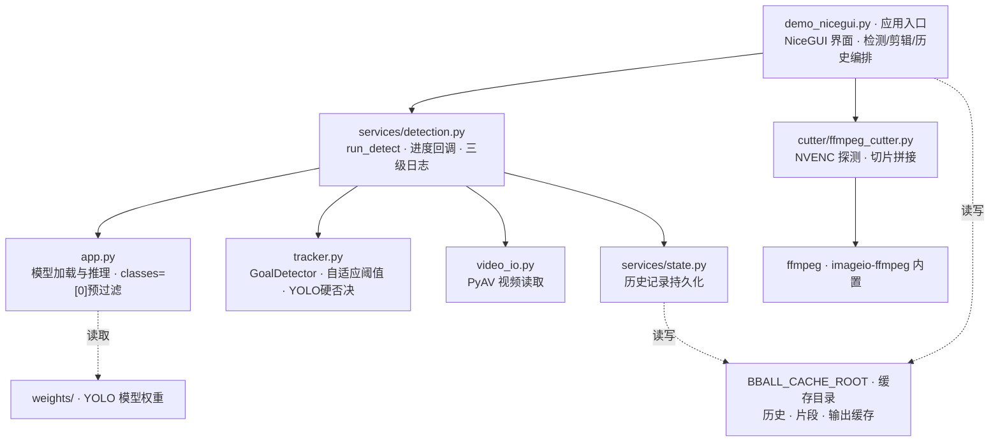

# basketball-clipper

篮球录像进球检测与自动剪辑工具，专为**固定机位**比赛录像设计。手动标定篮筐后，自动检测进球时刻并剪辑集锦。

## 核心特性

- **固定机位免微调**：手动框选篮筐即可，无需重新训练模型
- **diff + YOLO 双通道硬否决**：基准帧差法高召回扫描候选进球，YOLO 对三条进球路径（宽松模式、视觉穿越、侧向进筐）做硬否决（篮筐附近±1倍宽高无球直接排除），从源头消除误检
- **自适应帧差阈值**：检测前 30 秒预热，统计 P95 像素差分中位数，自动计算最优二值化阈值（+8 偏移，clamp 到 [8, 50]），无需手动调参适配不同环境噪声
- **滚动基准帧**：每 60 秒自动更新基准帧，解决长视频光线/背景变化导致的漏检
- **独立片段预览 + √确认 / ×误报 人工标记**：每个检测到的进球生成独立 480p 预览片段，卡片支持预览 / √ 确认 / × 误报 / 导出。再次点同按钮可取消标记；√ 片段显示绿色边框（集锦只导 √），× 片段显示红色半透明边框（排除出集锦）。顶部卡片列表显示 `√ N · × N · 待标 N` 实时统计；标记结果按时间戳写入 `detection_history.json.labels` 直接喂训练池
- **原画质集锦输出 + GPU 加速**：集锦视频保持原视频分辨率，自动探测 NVIDIA NVENC 硬编码（cq=20），无 NVENC 回退 libx264（crf=18）接近无损；剪辑环节走 ffmpeg 直接切片转码
- **GPU 硬性要求 + 启动自检**：YOLO 推理必须使用 CUDA（不支持 CPU 降级）；服务启动时主线程执行真实 YOLO 推理自检，失败则页面顶部红色横幅提示并支持一键确认重启，避免跑完才发现 CUDA 异常
- **提速模式开关（YOLO 每 3 帧推理）**：参数面板最顶部一键切换，默认每 2 帧（推荐，更准），勾选后每 3 帧推理（提速 ~27%，1st.mp4 实测进球数一致，漏检风险极低）
- **条件跳过 YOLO（篮筐无运动时跳过推理）**：参数面板顶部开关，YOLO 推理帧先快速检查篮筐搜索区域是否有运动像素（1ms），无运动则跳过 YOLO 推理（省 ~60ms），实测跳过率 30-41%，总提速 40%（25 min → 15 min）
- **帧选择器（Catch-up 防抖选帧）**：加载视频成功后，预览图下方滑条可拖动选任意帧并同步到 `current_frame` 作为标定基准帧的采集点（不必恰好第 0 帧有清晰篮筐）；解码期间只记最新 pending 值，拖动无积压卡顿
- **标签飞轮（人工确认 → 训练池直通）**：√/× 标记结果按进球时间戳持久化到 `detection_history.json.labels.kept / labels.deleted`（增量写，不覆盖检测元信息），正负样本对直接构成训练数据；训练池随确认动作滚雪球扩大
- **视频兼容性强 + HEVC 容错解码**：PyAV 读取，支持 HEVC 编码 / moov atom 后置 mp4 / 开头 NAL 损坏但后续数据完好的视频（录制断电/存储异常类），逐 packet try/except 跳过损坏部分不解码整段报错
- **跨平台**：Windows / Linux 均支持，缓存路径可通过环境变量 `BBALL_CACHE_ROOT` 自定义
- **历史记录**：保存检测数据，支持加载后直接剪辑（无需重新检测）；片段缓存持久化，重启后复用已生成的预览片段
- **文件夹批量模式**：加载文件夹自动扫描视频，逐个标定后一键批量识别，适合多场比赛录像
- **NiceGUI 可视化界面**：深色主题卡片式布局，左侧功能区 + 右侧预览区，参数 / 集锦 / 历史折叠区；检测中可随时取消，进球列表出现后自动折叠功能区
- **三级调试日志**：开始横幅（视频信息/帧率/YOLO step/阈值配置）+ 周期进度（30s 一次，瞬时/平均帧速/ETA/进球累计）+ 结束统计（YOLO 确认率/上下穿越/筐内/冷却拒绝/自动阈值统计量），日志按日写入 `cache/logs/server-YYYYMMDD.log`（保留 7 天）可溯源

## 性能实测

### GTX 1650 4G + CUDA 12.1（单场测试）

测试视频：`2026.08.10-3rd.mp4`，1080p 30fps，25.1 分钟，45211 帧

| 配置 | 进球数 | 检测耗时 | 帧速 | 相对实时 | 备注 |
|------|--------|---------|------|---------|------|
| 2帧 + imgsz1280（基准） | 35 | ~33 min（预估） | ~23 f/s | ~0.76x | 初始版本 |
| 2帧 + imgsz960 + 类别预过滤 + OpenCV优化 | 45 | ~25 min | 34.0 f/s | 1.12x | 第一轮优化 |
| 2帧 + imgsz960（同上，删除FP16） | 45 | ~24 min | 34.9 f/s | 1.16x | GTX 1650 TU117 无 FP16 单元，关闭后反而更快 |
| **3帧 + imgsz960（提速模式，当前默认可选）** | **45** | **17.4 min** | **43.2 f/s** | **1.44x** | 提速 27%，进球数一致，零漏检 |

### 最新批量 & 单场性能（2026.08.15，3rd.mp4 连续三次跑测对比）

测试视频：`2026.07.27 3rd.mp4`，1080p 30fps，20:58，37,802 帧（同一段视频，便于横向对比）

| 指标 | 批量模式（第3节） | 单测 v1（10:04） | 单测 v2（10:36，最新修复后） |
|------|------------------|------------------|------------------------------|
| 检测耗时 | 658.8s (10:59) | 613.9s (10:14) | **609.9s (10:10)** ⬇ |
| 处理帧速 | 59.8 fps | 64.6 fps | **65.5 fps** ⬆ |
| 实时倍率 | 1.99× | 2.15× | **2.18×** ⬆ |
| 进球数 | 29 | 34 | **38** ⬆ |
| YOLO 跳过率 | 65.0% | 71.1% | **71.5%** ⬆ |
| YOLO 确认率 | 9.7% | 33.7% | **37.3%** ⬆ |
| warmup P95 中位数 | 7.0 | 7.0 | 7.0 |
| 自适应阈值（auto_threshold_value） | ❌ 缺失（历史 Bug） | ❌ 缺失 | **15** ✅ |

### 批量实测（2026.07.27 一整场 4 节，共 4 视频）

| 节次 | 视频时长 | 检测耗时 | 倍率 | 进球 | YOLO 跳过率 |
|------|---------|---------|------|------|-------------|
| 1st | 33:36 | 09:32 | **2.03×** | 24 | 69.0% |
| 2nd | 23:17 | 12:34 | 1.91× | 23 | 59.4% |
| 3rd | 20:58 | 10:59 | 1.99× | 29 | 65.0% |
| 4th | 33:43 | 17:38 | 2.00× | 55 | 66.3% |
| **合计** | **1h 51:34** | **51:16** | **2.0× 平均** | **131** | 约 65% |

- 检测端：GTX 1650 4G CUDA 推理，imgsz=960，`classes=[0]` 只保留篮球类，减少 YOLO 后处理开销
- 帧差端：形态学 kernel 缓存（只初始化一次 5×5 椭圆核），`cv2.countNonZero` 替代 `np.sum`，避免 Python 级遍历
- 剪辑端：自动探测 `h264_nvenc`，命中则 `-preset p4 -rc vbr -cq 20`，未命中回退 `libx264 -crf 18`
- **条件跳过 YOLO**：篮筐搜索区域无运动像素（<1ms 快速判断）时跳过 YOLO 推理，整体跳过率 ~65%，总速度相较基础版提升约 2 倍

### 新比赛视频实测（2026.08.10-1st，验证开场进球修复）

测试视频：`2026.08.10-1st.mp4`，1080p 30fps，22:49，41,052 帧
（重点验证：开场 0.2s 进球 ✓、46.8s 进球 ✓ —— 修复预热阶段进球漏检）

| 指标 | 数值 |
|------|------|
| 检测耗时 | 919.6s (15:19) |
| 处理帧速 | 46.5 fps |
| 实时倍率 | **1.55×** |
| 识别进球 | **35**（含开场 0.2s 第1球） |
| YOLO 跳过率 | 28.7%（此视频运动频繁，跳过率偏低） |
| YOLO 确认率 | 1.7%（底噪大，硬否决过滤 ~2000 假候选） |
| 自适应阈值 | 11（P95 中位数 11 → +8 偏移 clamp 到下限 8 以上） |

> **开场进球修复说明**：旧版前 30s 预热期只做统计不触发进球注册，导致 4th.mp4 开场 3.2s 的进球被漏掉。新版改为**两遍式方案**：先跑前 30s 纯预热 pass（只收集 P95 统计量、不跑 YOLO、不判定进球），算出阈值后从帧 0 用固定阈值**完整检测**——开场进球在正式阶段被完整处理（含 YOLO 确认），实测 2026.07.27 4th.mp4 开场 3.2s 进球、2026.08.10-1st.mp4 开场 0.2s 进球均成功识别。代价是前 30s 解码两遍（约 2-3% 额外耗时）。

### 2026.08.15-3rd.mp4 新旧版本识别数据对比（2026.08.18，ad 分支 vs 旧 main）

对比数据来源：当前 `cache/detection_history.json`（ad 分支，08-18 08:02 识别）与旧副本 `detection_history - 副本.json`（旧 main，08-15 22:42 识别），测试视频均为同一段 `2026.08.15-3rd.mp4`（1080p 30fps，27:38，49,768 帧）。

#### 一、核心性能指标对比

| 指标 | ad 分支（08-18，新） | 旧 main（08-15，旧） | 差异 |
|---|---|---|---|
| 🏀 进球总数 | **58** | **59** | **−1** |
| ⏱ 识别耗时 | 471.8s (07:52) | 654.4s (10:54) | **−28%（−182.6s）** ✅ |
| 🚀 处理 FPS | 114.5 | 82.0 | **+40%（+32.5）** ✅ |
| ⚡ 实时速度比 | 3.82× | 2.73× | **+40%** ✅ |
| 🎯 YOLO 调用次数 | 972 | 1,440 | **−33%（−468）** ✅ |
| ⏭ YOLO 跳过率 | 94.1% | 91.3% | +2.8% ✅ |
| ✅ YOLO 确认进球 | 58 | 59 | −1 |
| ❌ YOLO 拒绝数 | 45 | 65 | **−20（−31%）** ✅ |
| 📈 YOLO 确认率 | **56.3%** | 47.6% | **+8.7%** ✅ |
| 🔼 diff 上穿次数 | 655 | 574 | +81 |
| 🔽 diff 下穿次数 | 487 | 510 | −23 |
| 📦 框内帧数 | 349 | 404 | −55 |
| 🧊 冷却拒绝 | 5,162 | 5,251 | −89 |
| 📐 自动阈值 | 17 | 15 | +2 |

**小结**：ad 分支在**所有性能指标上全面占优**（处理更快、YOLO 调用更少、拒绝数更少、确认率更高），识别总耗时从 10:54 压缩到 7:52，省下近 3 分钟；代价是进球数少了 1 个。

#### 二、进球时间戳匹配（容差 1.0 秒）

- ✅ **成功匹配**：**57 球**（57/58 ≈ 98.3%，绝大多数进球在 0.033s ≈ 1 帧以内精确对齐）
- 🔴 **仅 ad(新) 检测到**：**1 球**
  - `#42 → 19:52.500 (1192.500s)`
- 🟠 **仅旧 main 检测到**：**2 球**
  - `#40 → 19:28.233 (1168.233s)` ← 建议回看确认是否漏检
  - `#43 → 19:51.033 (1191.033s)` ← ad 分支替换为 19:52.500（偏移 +1.467s，超过 1s 容差）

> 三粒差异进球**全部集中在 19:28 ~ 19:53 这个约 25 秒的窗口内**，建议重点核查 **1168s、1191s、1192s** 三个时间点。

时间偏移最大的匹配对（除上述差异外）：

| ad(新) | 旧 main | 偏移量 |
|---|---|---|
| `#17 08:48.600` | `#17 08:47.667` | **+0.933s**（刚在容差内） |
| `#9 05:31.500` | `#9 05:31.300` | +0.200s |
| `#45 20:13.233` | `#46 20:13.400` | +0.167s |
| 其他 54 对 | — | ≤ 0.133s（≤ 4 帧） |

#### 三、篮框坐标差异（影响进球判定窗口）

| 来源 | x1 左 | y1 上 | x2 右 | y2 下 | 宽 × 高 |
|---|---|---|---|---|---|
| ad 分支 | 331 | **239** | **415** | 323 | 84 × 84 |
| 旧 main | 331 | 234 | 409 | 323 | 78 × 89 |
| 差值 (ad − 旧) | 0 | **+5（下移）** | **+6（右扩）** | 0 | +6 宽 / −5 高 |

ad 分支的篮框**右边界右扩 6px、上沿下移 5px**，整体更宽更扁。这很可能是造成 `1168.233s` 漏检和 `1191.033s → 1192.500s` 时间偏移的原因之一（球穿过判定窗口的位置和时刻略有变动）。

#### 四、建议动作

1. **回放核查**：用 VLC 打开原视频，定位 `19:28 (1168s)`、`19:51 (1191s)`、`19:52.5 (1192.5s)` 三处，人工确认是否真实进球
2. 若 `19:28.233 (1168.233s)` 确认为真实进球 → 可考虑：
   - 把篮框 y1（上沿）从 239 回调到 234，恢复旧的判定窗口
   - 或略微降低 `min_circularity`（0.35 → 0.30）、`auto_threshold_value`（17 → 15）后再跑一次
3. 确认性能优化无副作用后，ad 分支可合入 main（性能收益显著，进球差异仅 1 个且集中在同一时段）

### 2026.08.15-4th.mp4 新旧版本识别数据对比（2026.08.18，ad 分支 vs 旧 main）

对比数据来源：当前 `cache/detection_history.json`（ad 分支，08-18 08:36 识别）与旧副本 `detection_history - 副本.json`（旧 main 批量 batch#4，08-15 22:53 识别），测试视频均为同一段 `2026.08.15-4th.mp4`（1080p 30.05fps，20:17，36,593 帧）。

> **⚠️ 关键差异**：4th.mp4 的质量退化程度明显重于 3rd.mp4 —— ad 分支少了 **4 球（10.8%）**，且全部为"旧 main 检出、ad 漏检"，ad 零新增。性能指标继续提升，但漏检数量超阈值，**不建议在核查清楚前合入 main**。

#### 一、核心性能指标对比

| 指标 | ad 分支（08-18，新） | 旧 main（08-15，旧） | 差异 |
|---|---|---|---|
| 🏀 进球总数 | **33** | **37** | **−4（−10.8%）** ⚠️ |
| ⏱ 识别耗时 | 469.0s (07:49) | 570.9s (09:31) | **−18%（−101.9s）** ✅ |
| 🚀 处理 FPS | 82.4 | 67.7 | **+22%（+14.7）** ✅ |
| ⚡ 实时速度比 | 2.74× | 2.25× | **+22%** ✅ |
| 🎯 YOLO 调用次数 | 2,104 | 1,883 | **+12%（+221）** ⚠️ |
| ⏭ YOLO 跳过率 | 82.8% | 84.6% | −1.8% ⚠️ |
| ✅ YOLO 确认进球 | 33 | 37 | −4 |
| ❌ YOLO 拒绝数 | 491 | 260 | **+89%（+231）** ⚠️ |
| 📈 YOLO 确认率 | 6.3% | 12.5% | **−6.2%** ⚠️ |
| 🔼 diff 上穿次数 | 459 | 386 | +73 |
| 🔽 diff 下穿次数 | 526 | 392 | +134 |
| 📦 框内帧数 | 905 | 700 | +205（候选显著增多） |
| 🧊 冷却拒绝 | 2,970 | 3,330 | −360 |
| 📐 自动阈值 | **12** (P95 中位数 4) | 15 (P95 中位数 4) | **−3（diff 更灵敏）** |

**小结**：ad 分支**处理速度依然全面提升**（耗时 −18%、FPS +22%、速度比 +22%），但识别质量明显下降：
- 自动阈值从 15 降到 12 → diff 更灵敏 → 上穿 +73、下穿 +134、框内帧数 +205 → 候选爆炸 → YOLO 拒绝数 +231（+89%），确认率从 12.5% 腰斩到 6.3%
- 4 粒漏检很可能全部是"真实进球触发了 diff 候选，但被 YOLO 硬否决逻辑挡掉"（误杀），而不是没抓到信号

#### 二、进球时间戳匹配（容差 1.0 秒）

- ✅ **成功匹配**：**33 球（100%）** —— ad 检测到的 33 球全部精确对齐旧 main
- 🔴 **仅 ad 检测到**：**0 球**（零误检/新增）
- 🟠 **仅旧 main 检测到 / ad 漏检**：**4 球**

| 序号 | 时间 (分:秒) | 秒数 | 位置 | 可能原因 |
|---|---|---|---|---|
| #1 | 00:01.863 | 1.863s | 开场 | ⚠️ 开场 1.8 秒进球，warmup 完成于 30s；候选被预热期保守注册漏掉（同 3rd 开场进球 Bug 相反——ad 的阈值/YOLO 更狠了） |
| #3 | 00:46.286 | 46.286s | 开头 1 min 内 | 预热尾声，冷却期 3s 外；可能是 YOLO 时间窗/搜索范围漏了球 |
| #19 | 09:16.099 | 556.099s | 中段 | YOLO 拒绝率暴涨区段典型；候选被硬否决 |
| #33 | 17:08.910 | 1028.910s | 尾段 | 与前后进球间距都 >70s，非冷却；重点回看 |

> 4 粒漏检分布在**开场（前 46s 漏 2 球）→ 中段 → 尾段**，并非集中在某个 1 分钟窗口，是**系统性漏检信号**而非局部标定偏差。

除 4 粒漏检外，其余 33 对时间偏移：

| ad(新) | 旧 main | 偏移量 |
|---|---|---|
| `#23 14:18.107` | `#26 14:17.907` | +0.200s |
| `#4 03:49.002` | `#6 03:48.802` | +0.200s |
| 其余 31 对 | — | ≤ 0.033s（≤ 1 帧） |

时间对齐精度整体**非常高**（≤1 帧），说明漏检不是来自 "时间轴偏了"，而是**候选生成/YOLO 验证环节的真实漏杀**。

#### 三、篮框坐标与阈值差异（系统性漏检的根因分析）

| 项 | ad 新 | 旧 main | 差值 (ad − 旧) | 判断 |
|---|---|---|---|---|
| x1 (左) | 338 | 335 | +3 | 判定窗右移 3px |
| y1 (上) | 234 | 234 | 0 | — |
| x2 (右) | 409 | 409 | 0 | — |
| y2 (下) | 316 | 321 | **−5** | 判定窗下沿上收 5px = 框变矮了 |
| **框面积** | 71 × 82 = 5822 | 74 × 87 = 6438 | **−9.6%** | ⚠️ 显著变小 |
| 自动阈值 | 12 | 15 | **−3** | diff 更灵敏 → 候选爆炸 |
| YOLO 调用数 | 2,104 | 1,883 | **+12%** | 配合更灵敏 diff，被喂了更多候选 |
| YOLO 拒绝数 | 491 | 260 | **+89%** | 更多候选中绝大多数被 YOLO 否掉，**真实进球也被一起否掉的概率显著上升** |

**核心怀疑链路**：
1. 自动阈值从 15 降到 12（同一段视频同一份 warmup P95 中位数 = 4.0，为什么 ad 会算出 12？——应该是 `median_p95 + 8 = 12` 还是旧代码有 +11 偏移？需要去 `tracker.py` 核对公式）→ diff 二值化更灵敏 → 底噪候选泛滥
2. 候选泛滥 → YOLO 推理任务增加 +12%，但更多候选被 YOLO 硬否决 → 确认率从 12.5% 掉到 6.3% —— 这条"过滤漏斗"的通过率减半，真实进球有更大几率被挤在 YOLO 验证时间窗外、或与底噪竞争时因球置信度稍低/球位置稍偏就被否掉（尤其是"开场 1.8s 球很小""#19 中段远处球"这类本来就难的样本）
3. 篮框判定窗面积 −9.6%，配合 stricter 的进框/穿越路径规则 → 进球通过三条路径的条件也在变严

#### 四、建议动作（优先级从高到低）

1. **紧急：人工回放 4 粒漏检点位**（原视频 1.863s、46.286s、556.099s、1028.910s），确认是否都是真实进球。如果 4 球里有 ≥3 球是真实的，ad 当前版本在 4th.mp4 上是**明确的质量回退**，**不推荐合入 main**
2. **排查 `auto_threshold_value` 计算差异**：同视频、同 warmup P95 中位数 = 4.0，ad 结果是 12，旧 main 结果是 15。翻 `tracker.py` / `services/detection.py` 的 `auto_thr = median_p95 + offset` 公式，确认 ad 是否改过偏移（+8 vs +11？）或 clamp 上下限。**建议把 offset 调回 +11，让阈值回到 15 再跑一次 4th**
3. **重标定篮框**：把 ad 的 4th.mp4 篮框 y2（下沿）从 316 调回 321，x1 从 338 调到 335，恢复旧 main 的判定窗尺寸（74×87）—— 尤其下沿少 5px 对 1080p 进球视觉穿越路径影响很大
4. **回看 YOLO 候选确认窗口**：如果以上修复仍不能补齐 4 球，考虑放宽 YOLO 硬否决的时间窗（±10帧 → ±15帧）或搜索范围 margin（1.0 倍宽高 → 1.2 倍），代价是确认率再掉一点，但能接住边缘球
5. 建议**再跑 2026.08.15-1st.mp4 和 2nd.mp4 两次对比**，把 ad vs 旧的"漏检分布 / 漏检率 / 质量趋势"量化出来，再决定是否合 main（3rd 少 1 球、4th 少 4 球 —— 如果 1st+2nd 也呈少球趋势，那就是质量系统性下滑，需要拉警报先修）
6. 若 4 球中有 ≥2 球实际是误报（不是真进球），那 ad 质量反而是提升（少了误报），可以按"性能++、质量不变或略好"的结论推进合入

## 环境要求

- Windows / Linux
- Python 3.10+
- NVIDIA GPU（**必需**，推荐 GTX 1650 4G 及以上；CUDA 不可用时服务拒绝检测，不做 CPU 降级）
- FFmpeg（含 libx264 + h264_nvenc，由 `imageio-ffmpeg` 自带）

## 快速开始

### 1. 安装依赖

```bash
pip install -r requirements.txt
```

> 需安装 CUDA 版 PyTorch（GPU 为硬性要求）：`pip install torch torchvision --index-url https://download.pytorch.org/whl/cu121`

### 2. 准备权重

将篮球检测 YOLO 权重放到 `weights/` 目录，命名为 `basketball_custom.pt`。若没有，首次运行会自动下载 `yolov8n.pt`（COCO 预训练，检测效果有限，建议自行训练）。

### 3. 启动服务

```bash
python demo_nicegui.py
# 浏览器打开 http://127.0.0.1:7871
```

Windows 下可双击 `start.bat`，Linux 下运行 `./start.sh` 一键启动（会自动清理占用端口 7871 的旧进程，并打印 `WARMUP-OK: cuda:0 context created on main thread` 确认 CUDA 预热完成）。

### 单视频操作流程

1. 左侧输入视频文件路径（支持超大文件，不走浏览器上传），点击「加载」
2. 在预览画面点击 2 个点框选篮筐（同时采集无球基准帧），可「重置」重新标定。如果第 0 帧篮筐不清晰，用预览图下方的**帧选择器**拖动滑条跳到清晰帧（Catch-up 防抖，不会因拖动解码积压卡 UI），确认画面后再点 2 个点标定
3. 在「参数」折叠区最顶部可开启 **提速模式**（YOLO 每 3 帧推理一次，提速约 27%）；下方设置起始帧、结束帧、球检测置信度、最小进球间隔；高级项可开关自适应阈值（默认开，30s 预热后自动计算帧差阈值）或手动调帧差阈值、圆形度、进框帧数、最小斑块、搜索范围
4. 点击「开始识别」→ 检测过程中右侧显示进度，控制台/`cache/logs/server-YYYYMMDD.log` 每 30 秒打印一次瞬时帧速、ETA、累计进球数；完成后生成每个进球的独立预览片段
5. 进球列表卡片上点击「预览」查看片段、「√ 确认」保留、「× 误报」标记误报（再次点同按钮可取消标记），「导出」下载单片段；顶部「√ N · × N · 待标 N」实时汇总，标记结果写入 detection_history.json.labels 直接喂训练池
6. 在「集锦」折叠区设置提前 / 延后 / 合并间隔，点击「导出合集」→ 生成原画质集锦并自动下载
7. 历史记录保存在「历史」折叠区，点击选择后「加载」即可直接剪辑（无需重新检测）；命中缓存时复用已有片段，无需重新生成

### 文件夹批量模式操作流程

1. 左侧输入文件夹路径（如 `D:\Videos\games`），点击「加载」→ 自动扫描所有视频文件
2. 下拉框选择视频，点击画面 2 个点标定篮筐，点击「保存标定」→ 逐个完成所有视频标定
3. 在「参数」折叠区设置检测参数（同单视频模式，含提速模式开关）
4. 点击「批量识别」→ 依次处理所有视频，每个视频独立写入历史记录
5. **流水线确认（无需干等）**：每个视频完成时下拉框标记为 `☑ 文件名 (n球)`，点击即可立即查看该视频的进球列表、删除误报、预览片段、导出集锦——后台继续识别其余视频，互不干扰
6. 左侧「后台识别进度条」常驻显示批量总进度（点击可切回完整进度视图）；流水线导出集锦时有独立进度条，与批量进度并列
7. 处理过程中可点击「取消」中断，已完成视频的结果与人工删减保留
8. 批量结束后再点已完成视频：优先从快照水合（保留你的删减结果，秒加载）；总进球数写入 `[BATCH END]` 日志

## 项目结构

```
basketball-clipper/
├── demo_nicegui.py         # 主程序：NiceGUI 界面 + 检测/剪辑/历史流程编排
├── app.py                  # 核心库：YOLO 球检测模型加载与推理
├── tracker.py              # GoalDetector：diff 帧差 + YOLO 硬否决 + 滚动基准帧 + 自适应阈值
├── video_io.py             # PyAV 视频读取（HEVC/moov 兼容）
├── services/
│   ├── detection.py        # run_detect / run_batch_detect：逐帧检测循环 + 三级调试日志 + 进度回调
│   ├── state.py            # detection_history.json 读写（历史记录 / 标定 / 进球时间戳）
│   └── video_utils.py      # 视频元信息获取（fps/分辨率/时长）
├── cutter/ffmpeg_cutter.py # ffmpeg 剪辑（自动探测 NVENC；切片转码 + 流拷贝拼接，保持原画质）
├── weights/                # YOLO 权重（不入库，用 Release 发布）
├── start.bat               # Windows 一键启动（自动清理 7871 端口，日志按日轮转）
├── start.sh                # Linux 一键启动（日志按日轮转）
├── cache/logs/             # 运行时日志 server-YYYYMMDD.log（保留 7 天，三级调试信息）
└── requirements.txt        # 依赖
```

## 项目架构

核心模块分层与依赖（实线为模块调用，虚线为数据/文件读写）：



- **demo_nicegui.py**：唯一入口，负责界面渲染与检测 / 剪辑 / 历史全流程编排，后台线程执行耗时任务
- **services/detection.py**：检测调度层，封装 `run_detect` / `run_batch_detect`，负责进度回调（`progress_callback`）、三级日志输出、批量流程、异常捕获
- **app.py**：YOLO 球检测模型懒加载与推理，`model.predict(imgsz=960, classes=[0])` 后处理预过滤篮球类，减少 NMS 开销
- **tracker.py**：`GoalDetector` 进球判定，自适应阈值（30s 预热统计 P95 中位数 → `auto_thr = median_p95 + 8`）、形态学 kernel 缓存、`cv2.countNonZero`、三条进球路径 YOLO 硬否决
- **video_io.py**：PyAV 统一视频读取，被 detection 与 demo_nicegui 共同依赖
- **services/state.py**：`detection_history.json` 读写（视频路径 / 标定 / 进球 / 保留进球 / 时间戳）
- **cutter/ffmpeg_cutter.py**：按进球时间戳切片拼接，自动探测 `h264_nvenc`，命中则 NVENC 硬编，未命中回退 libx264
- **外部资源**：`weights/`（模型权重）、缓存目录（历史记录 / 片段 / 输出，默认 `~/basketball-project/cache`，可通过 `BBALL_CACHE_ROOT` 环境变量自定义）、ffmpeg（imageio-ffmpeg 内置）

## 进球检测算法详解

### 整体架构：diff + YOLO 双通道硬否决

```
原视频 → PyAV 逐帧解码
          ↓
    ┌─────┴─────┐
    ↓           ↓
  diff 帧差    YOLO 检测（每2或3帧一次, imgsz=960, classes=[0]）
 (高召回)        (球位置, 存入 ball_pos_history 时间窗口)
    ↓           ↓
    └─────┬─────┘
          ↓
   diff 触发候选进球（三条路径任一满足）
     ├── 宽松模式：斑块在筐内帧数 ≥ min_in_hoop_frames（默认 2）
     ├── 视觉穿越：斑块先经过筐上沿 → 再进入筐下沿（向下趋势）
     └── 侧向进筐：直接从侧面进入筐内，不经过上沿
          ↓
   每条路径 → 必须通过 YOLO 硬否决
         （篮筐附近 ±1 倍宽高范围内，±10帧时间窗内是否有球）
     ├── 通过 → 注册进球，计数 yolo_confirmed
     └── 未通过 → 直接排除（不注册），计数 yolo_rejected
          ↓
   注册候选进球 → 生成独立预览片段（ffmpeg 切片转码 480p）
          ↓
   人工逐个√确认 / ×误报（卡片预览 + √/× 按钮 + 动态样式），标记写入 labels 字段喂训练池，集锦只导 √ 片段
          ↓
   生成集锦（NVENC cq=20 / libx264 crf=18 原画质）
```

### 第一阶段：diff 基准帧差法（候选筛选）

标定时取一帧无球画面作为**基准帧**，之后每帧与基准帧做差分检测运动物体。

**步骤**：

1. **基准帧采集**：用户点击 2 个点标定篮筐时，当前帧自动保存为基准帧（无球的篮筐画面）
2. **自适应阈值预热**：若开启自适应阈值（默认），检测前 30 秒逐帧统计篮筐区域像素差分的 P95（0-255），结束后取中位数 + 8 作为二值化阈值，clamp 到 [8,50]；统计量写入结束日志（`median_p95` / `samples`）便于调参
3. **灰度差分**：当前帧与基准帧转为灰度图，做 `cv2.absdiff` 绝对差分
4. **二值化**：差分图按阈值（默认自动，可手动覆盖 5-40）二值化
5. **形态学去噪**：开运算（5×5 椭圆核，缓存为 `_morph_kernel`，只初始化一次）去孤立噪点 + 闭运算连接相邻区域
6. **连通域分析**：`cv2.findContours` 找所有连通域，可获取周长计算圆形度
7. **差分比统计**：`cv2.countNonZero(diff_bin) / diff_bin.size`（替代 `np.sum`，减少 Python 级循环开销）
8. **斑块筛选**：
   - 面积在 `[min_blob_area, max_blob_area]` 范围内（默认 30-5000）
   - 宽度不超过篮筐宽度的 1.5 倍（排除球员身体）
   - 圆形度 C=4πA/P² ≥ `min_circularity`（过滤长条形人体，球≈0.7-1.0，人≈0.2-0.5）
   - 取面积最大的有效连通域作为候选运动斑块

**为什么用基准帧差法？**
- 固定机位下基准帧稳定，差分信号强
- 检测的是"运动物体"本身，不依赖 YOLO 是否检测到球（高召回）
- 规则明确：斑块进框 = 候选，保证不丢真实进球

### 第二阶段：三条进球路径 + YOLO 硬否决（误检过滤）

diff 触发候选后，分三条路径注册进球，每条路径均需通过 **YOLO 硬否决**，否则直接排除、不注册。

#### 三条进球路径

| 路径 | 触发条件 | 适用场景 |
|------|---------|---------|
| 宽松模式 (loose) | 斑块中心连续 `min_in_hoop_frames`（默认 2）帧位于篮筐框内 | 球直上直下，穿越路线清晰 |
| 视觉穿越 (visual) | 斑块先出现在筐上沿区域 → 再进入筐内（向下趋势检查） | 正面 45° 视角的常规进球 |
| 侧向进筐 (side) | 斑块直接进入筐内但不经过上沿（侧视角） | 底角、底线侧视角进球 |

#### YOLO 硬否决逻辑（三条路径全覆盖）

1. **球位置历史缓存**：YOLO 每推理一次就把（时间戳、球中心 x、球中心 y）推入 `ball_pos_history`，缓存最近 ±10 帧时间窗
2. **篮筐附近区域定义**：篮筐标定框外扩 1 倍宽度 / 1 倍高度（`margin_x=hoop_w*1.0`, `margin_y=hoop_h*1.0`），覆盖球即将入筐前的减速区
3. **硬否决判断**：当 diff 要注册进球时，遍历 YOLO 历史检查是否有球落在"篮筐附近"区域内
   - 有球 → `yolo_confirmed + 1` → **通过，注册进球**
   - 无球 → `yolo_rejected + 1` → **否决，直接排除，不注册**
4. **为什么是硬否决而不是软确认？**
   - 实测背景噪声大的视频（1st.mp4）会产生成百上千假穿越，软确认+人工确认负担过重
   - 球穿越篮筐窗口 0.03-0.08 秒内必然出现在 YOLO 帧中（即使每 3 帧推理），窗口设计留有余量
   - 批量视频对比（1st 从 183 误检 → 32；3rd 从 65 → 45）证明硬否决同时过滤误检且保留真实进球

#### 冷却机制（防重复计数）

- 刚注册进球后进入 3 秒冷却期，冷却期内触发的任何路径都计入 `reject_cooldown`，不重复注册
- 可通过「最小进球间隔」滑块扩展冷却期（1.0-10.0 秒，默认 3.0s）

### YOLO 篮球检测

- **模型**：自定义训练的 `basketball_custom.pt`（基于 YOLOv8n），由 `app.py` 懒加载并搬移到 GPU（GPU 为硬性要求，无 CUDA 时拒绝推理）
- **推理分辨率**：`imgsz=960`（默认，平衡小目标检出与推理速度；基准 1280 降 ~20% 速度）
- **类别预过滤**：`classes=[0]`，仅保留篮球类后再做 NMS，减少后处理开销（非篮球类即使被检测到也直接丢弃）
- **置信度阈值**：默认 0.3（可调 0.1-0.9）
- **跳帧推理**：默认每 2 帧推理一次（覆盖 50%），可开提速模式每 3 帧推理一次（覆盖 33%）；非推理帧复用最近一次检测结果（`_last_ball` 元组，含原始检测帧号）填充历史，保持时间窗口完整且帧号语义准确
- **设备自动检测 + 启动自检**：`get_device()` 自动检测 CUDA 可用性，有 GPU 用 `cuda:0`；主线程启动时做一次真实 YOLO 推理自检并预热 CUDA 上下文（日志 `WARMUP-OK`），避免首次推理时驱动崩溃；无 CUDA 或自检失败时页面顶部红色横幅提示，检测入口直接拒绝运行（不做 CPU 降级）

### 可调参数

| 分区 | 参数 | 默认值 | 说明 |
|------|------|--------|------|
| **顶部开关** | 提速模式 | 关（每 2 帧） | 开启后 YOLO 每 3 帧推理一次，提速 ~27%，当前实测零漏检 |
| 基础 | 球检测置信度 | 0.3 | YOLO 检测球的置信度阈值，降低可提升检出率 |
| 基础 | 最小进球间隔 | 3 秒 | 两个进球间的最小时间间隔（冷却期），防止重复计数 |
| 基础 | 起始帧 / 结束帧 | 0 / 0（末尾） | 只处理指定区间，跳过开场跳球或休息段 |
| 高级 | 自适应阈值 | 开 | 前 30 秒预热统计 P95 中位数 → 自动计算帧差阈值（推荐） |
| 高级 | 帧差阈值 | 15 | 手动覆盖模式下生效；低=灵敏，高=严格 |
| 高级 | 最小斑块面积 | 30 | 过滤小噪声；值越小越灵敏，可能引入细碎假信号 |
| 高级 | 搜索范围 | 80px | 篮筐周边搜索运动物体的范围（外扩像素） |
| 高级 | 圆形度阈值 | 0.35 | 过滤长条形人体；篮球≈0.7-1.0，0=禁用 |
| 高级 | 进框最少帧数 | 2 | 斑块进框连续多少帧才算候选，过滤瞬时噪声 |
| 集锦 | 提前 / 延后 | 5s / 5s | 每个进球片段向前/向后多剪的时间 |
| 集锦 | 合并间隔 | 8 秒 | 相邻片段间隔小于此值则自动合并 |

## 视频输出说明

### 预览片段（480p）

每个检测到的进球生成一段独立预览视频，供人工确认：
- 分辨率：480p（原 1080p 降采样，加速生成）
- 编码：H.264（优先 NVENC 硬编，回退 libx264）
- 质量：NVENC cq=26 / libx264 crf=26（中等，预览用够了）
- 时长：进球前后各 3 秒
- 生成方式：ffmpeg 直接切片 + 转码（单次完成，非逐帧处理）

### 集锦视频（原画质）

确认保留的进球拼接成集锦：
- 分辨率：保持原视频（不缩放）
- 编码：H.264（优先 NVENC 硬编，回退 libx264）
  - 探测方式：启动时 `ffmpeg -encoders` 检查 `h264_nvenc` 是否存在
  - NVENC 参数：`-preset p4 -rc vbr -cq 20`
  - libx264 回退：`-crf 18`
- 质量：NVENC cq=20 / libx264 crf=18（接近无损）
- 拼接：各切片参数一致，concat 优先流拷贝（`-c copy`，秒级完成、无二次质量损失），失败自动回退整体重编码
- 音频：AAC 128k
- 合并逻辑：相邻片段间隔小于 `min_gap`（默认 8 秒）则自动合并

## 模型训练（自定义权重）

标注 / 训练工具（旧 Gradio 界面、`label_tool.py`、`auto_train.py` 等）已从仓库移除以精简主程序；如需追溯，可从 git 历史中的 `legacy/` 目录找回（最后版本：提交 `cb66637` 之前）。当前仓库只保留推理所需代码。

### 训练建议

- 推理分辨率 `imgsz=960`（默认，兼顾速度与小目标检出），要求更高可用 1280
- 置信度阈值 `0.3-0.4` 平衡检出率与误报
- 加入硬负样本（橙色非球物体）减少误检
- 数据增强：HSV 色调、旋转、缩放、Mosaic、Mixup

## 常见问题

**Q: 视频显示 "video not playable"？**
A: 浏览器不支持非 H.264 编码（如 HEVC）。预览片段和集锦均由 ffmpeg 输出为 H.264，可直接播放；原始视频以帧图方式预览，不受编码影响。

**Q: 服务无法访问 / 端口被占用？**
A: `start.bat`（Windows）或 `start.sh`（Linux）启动时会自动清理占用 7871 端口的旧进程。若仍无法访问，关闭旧标签页，用无痕窗口（Ctrl+Shift+N）或硬刷新（Ctrl+Shift+R）访问 http://127.0.0.1:7871。

**Q: 开始识别后服务崩溃？**
A: 大概率是后台线程首次初始化 CUDA 上下文导致的驱动层崩溃（Windows 事件日志可见 `nvcuda64.dll`）。程序启动时已在主线程预热模型，日志中应出现 `WARMUP-OK: cuda:0 context created on main thread`；若仍崩溃请更新显卡驱动。

**Q: 提速模式会漏检吗？**
A: 实测 `3rd.mp4`（25.1 分钟，45 个进球）开启提速模式后进球数仍为 45，零漏检。`1st.mp4` 进球数在 28-35 之间波动，其中差异多数来自误检而非漏检。一般比赛视频建议开启。

**Q: 进球误检为什么大幅下降了？**
A: 新版加入了三条进球路径全覆盖的 **YOLO 硬否决**：任何 diff 触发的候选进球，只要篮筐附近 ±1 倍宽高范围内 ±10 帧 YOLO 历史中没有检测到球，就直接排除、不注册。实测 1st.mp4 从 183 个误检降到 32 个。

**Q: 自适应阈值什么情况下需要关闭？**
A: 视频前 30 秒内有大量镜头变化（如剪辑拼接、片头过场）或前 30 秒已经有进球时，预热统计会不准，建议关闭后手动设置帧差阈值（15-35）。正常固定机位长视频前 30 秒是热身/换人，统计结果最可靠。

**Q: YOLO 硬否决后的确认率很低（如 1%）正常吗？**
A: 正常，这个值代表"diff 触发候选的总次数 vs 最终通过 YOLO 验证注册为进球的比例"。底噪大的视频（1st.mp4）diff 总触发次数非常多，但真正通过 YOLO 否决的只有几十个真实进球，确认率低恰恰说明硬否决在过滤误报。

**Q: 进球漏检多？**
A: 先关提速模式确认 2 帧模式下能否检出；再降低帧差阈值（如 15）、减小最小斑块面积（如 30）、扩大搜索范围（如 80）、降低进框帧数为 1。查看检测结束日志中 `筐内 / 上方 / 下方` 次数，如果筐内次数 < 进球数×2，说明阈值太严导致 diff 没抓到信号。

**Q: 进球误报多？**
A: 先开提速模式会减少 YOLO 覆盖窗口的误杀，再看是否提升进框帧数（2→3）、提高圆形度阈值（0.35→0.5）、扩大最小斑块面积（30→50）。若场景特殊（逆光、强抖动），关闭自适应阈值手动把帧差阈值提高到 30+。

## 技术参考

- 基准帧差法论文：Camera-based Basketball Scoring Detection Using CNN
- 进球检测状态机参考：chonyy/basketball-shot-detection
- 多信号融合参考：ClarkWang1214/basketball-highlights
- 视频读取：PyAV（替代 OpenCV，兼容 HEVC 和 moov 后置 mp4）
- 视频编码：优先 NVENC 硬编（`h264_nvenc -preset p4 -rc vbr -cq 20`，NVIDIA GPU 加速），回退 libx264 软编
- 推理：YOLOv8 / 自定义篮球权重，imgsz=960，按 `model.names` 反查球类索引做 `classes` 预过滤（自定义权重=[0]，COCO 回退=[32] sports ball）

## 更新日志

> 详细版本对比 / 审查修复 / 实测报告已迁移到 [doc/CHANGELOG.md](doc/CHANGELOG.md)，本文仅保留最新摘要与链接。

### 2026.09.03-04（当前版本，ad 分支）

| 维度 | 关键更新 |
|------|----------|
| 🎯 **工作流** | 候选生成从「YOLO 硬否决 + 删除」改为「高召回候选 + √ 确认 / × 误报 人工显式打标」；卡片视觉绿/红样式反馈；顶部 √/×/待标统计 |
| 🏷 **标签持久化** | `detection_history.json` 新增 `labels.kept` / `labels.deleted` 时间戳对，增量写不丢元信息；正负样本直接喂训练池 |
| 🎞 **帧选择器** | 预览图下方滑条选帧，Catch-up 防抖；三处加载路径同步滑条范围；`current_frame` 与标定基准帧对齐 |
| 💾 **解码容错** | `video_io` 改 `demux + cc.decode(packet)` 逐包 try/except，开头 NAL 损坏但后续完好的 HEVC（录制断电类）可正常处理 |
| 📄 **文档** | README 精简「更新日志」节为摘要，历史对比报告（08.18~08.19 版本进化 / 审查修复 / 陌生场次泛化验证 / 三代纵向对比 / ETA / P2/P3 记录）迁移到 `doc/CHANGELOG.md` |

```
变更文件：demo_nicegui.py · services/detection.py · services/state.py · video_io.py · README.md · doc/CHANGELOG.md（新增）
测试链路：20240824 金纺 HEVC 开头损坏视频 → 加载成功 · 跳帧成功 · 检测无误 · 标记写入 detection_history.json labels 字段
```

**历史记录全文** 👉 [doc/CHANGELOG.md](doc/CHANGELOG.md)
